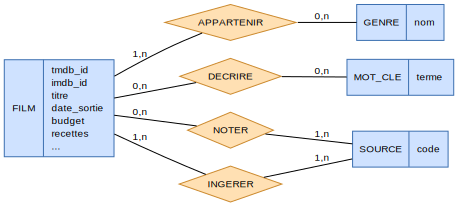
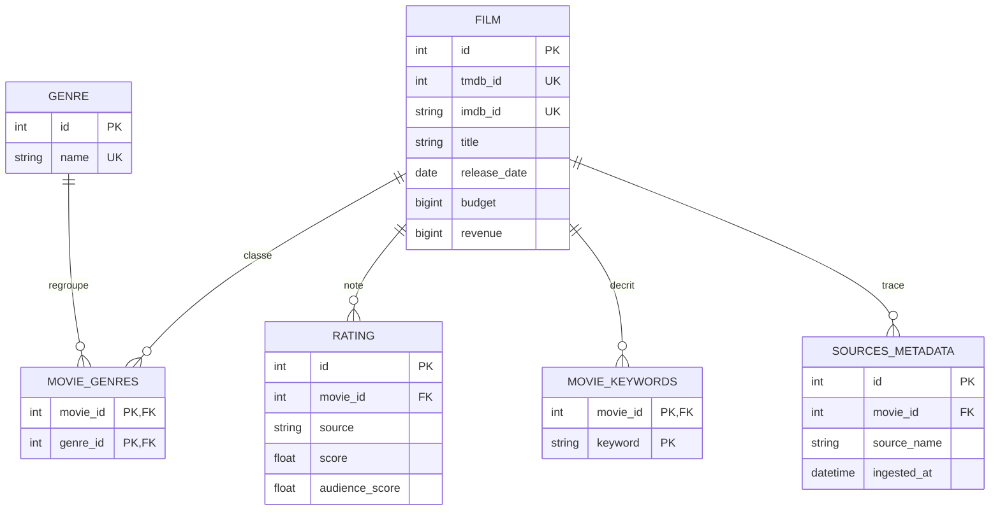

# Modélisation Merise — HorRAGor

Documentation de la base de données « Source de Vérité » du projet, conçue
selon la méthode **Merise** en trois niveaux :

| Niveau | Question | Artefact |
|--------|----------|----------|
| **MCD** — Conceptuel | *Quoi ?* (sens métier) | `mcd.svg` / `mcd.png` |
| **MLD** — Logique | *Comment, en relationnel ?* | `mld.svg` / `mld.png` + bloc Mermaid ci-dessous |
| **MPD** — Physique | *Avec quels types/SGBD ?* | `mpd.svg` / `mpd.png` + `../../src/horragor/db/schema.sql` (+ ORM `db/models.py`) |

---

## 1. MCD — Modèle Conceptuel de Données



Le MCD décrit les **entités** et leurs **associations** (losanges), avec les
**cardinalités Merise** `(min,max)` — sans clé étrangère ni type physique.

### Entités

- **FILM** — l'œuvre : `tmdb_id`, `imdb_id`, `titre`, `titre_original`,
  `langue_originale`, `synopsis`, `accroche`, `date_sortie`, `durée_min`,
  `budget`, `recettes`, `statut`, `collection`, `popularité`, `poster`,
  `nb_mots_synopsis`.
- **GENRE** — référentiel des genres : `tmdb_genre_id`, `nom`.
- **SOURCE** — référentiel des sources de données : `code`
  (`tmdb`, `imdb`, `rotten_tomatoes`, `kaggle`, `spark`), `libellé`.
- **MOT_CLE** — terme-clé extrait du synopsis (job Spark) : `terme`.

### Associations & cardinalités

| Association | Entités | Cardinalités | Attributs portés |
|-------------|---------|--------------|------------------|
| **APPARTENIR** | FILM — GENRE | `(1,n)` — `(0,n)` | — |
| **DÉCRIRE** | FILM — MOT_CLE | `(0,n)` — `(0,n)` | — |
| **NOTER** | FILM — SOURCE | `(0,n)` — `(1,n)` | `score`, `audience_score`, `vote_count`, `critics_consensus` |
| **INGÉRER** | FILM — SOURCE | `(1,n)` — `(1,n)` | `ingested_at` |

*Lecture* : un FILM appartient à **au moins un** genre ; un GENRE peut regrouper
**0 à n** films. Une SOURCE **note** plusieurs films, un FILM est noté par 0 à n
sources (les scores sont conservés en **échelle native** : TMDB/IMDB 0-10, RT 0-100).

---

## 2. MLD — Modèle Logique de Données



Règles de passage MCD → MLD appliquées :
- Chaque **entité** devient une table (sa clé devient la clé primaire).
- Une association **N-N** (`APPARTENIR`, `DÉCRIRE`) devient une **table de
  liaison** à clé composée.
- Une association **portant des attributs** (`NOTER`, `INGÉRER`) devient une
  table dédiée (`ratings`, `sources_metadata`).

### Schéma relationnel (notation Merise)

> **PK** en gras · `#` = clé étrangère

- **FILM**(**id**, tmdb_id, imdb_id, title, original_title, original_language,
  overview, tagline, release_date, runtime_minutes, budget, revenue, status,
  collection_name, popularity, poster_path, overview_word_count, created_at,
  updated_at)
- **GENRE**(**id**, tmdb_genre_id, name)
- **MOVIE_GENRES**(**#movie_id**, **#genre_id**)
- **RATING**(**id**, #movie_id, source, score, audience_score, vote_count,
  critics_consensus) — *UNIQUE(movie_id, source)*
- **MOVIE_KEYWORDS**(**#movie_id**, **keyword**)
- **SOURCES_METADATA**(**id**, #movie_id, source_name, ingested_at)

### Diagramme (Mermaid — rendu natif GitHub/VS Code)



---

## 3. MPD — Modèle Physique de Données



Le MPD complet (types SQL, contraintes, index) est le fichier exécutable
[`src/horragor/db/schema.sql`](../../src/horragor/db/schema.sql), dont l'**ORM
SQLAlchemy** [`db/models.py`](../../src/horragor/db/models.py) est la source de
vérité (création via `database.init_db()`). Points physiques notables :

- `budget` / `revenue` en **BIGINT** (certaines recettes dépassent 2,1 Md,
  limite de l'INTEGER 32 bits PostgreSQL).
- `ratings.source` contraint par **CHECK** `IN ('tmdb','imdb','rotten_tomatoes')`.
- **Index** sur les clés de réconciliation (`tmdb_id`, `imdb_id`), les FK et
  `movie_keywords.keyword` (future indexation RAG).
- Compatible **SQLite** (local) et **PostgreSQL/Supabase** (bascule par
  `DATABASE_URL`, cf. `db/database.py`).

---

## 4. Choix de modélisation

- **SOURCE dénormalisée** : l'entité SOURCE du MCD est implémentée comme un
  **attribut codé** (`source` / `source_name`, chaîne avec CHECK) plutôt qu'une
  table de référence. Justifié par un ensemble de sources **fixe et restreint**
  (5) : éviter une table-dimension triviale et ses jointures.
- **Mots-clés en table dédiée** (`movie_keywords`) : un mot-clé est un attribut
  **multivalué** du film → extrait dans sa propre relation, conformément à la
  **3NF** (pas de liste/CSV stockée dans `movies`).
- **GENRE keyé par `name`** (UNIQUE) : le Gold fusionne des genres en **noms**
  issus de plusieurs sources, dont certains sans `tmdb_genre_id` (devenu
  optionnel).
- **3NF** : aucune dépendance transitive ; les scores par source et les genres
  sont sortis de `movies` ; chaque fait est stocké une seule fois.
- **RGPD / minimisation** : le schéma ne stocke **aucune donnée personnelle**
  (ni casting nominatif, ni utilisateur) — uniquement des métadonnées d'œuvres
  et des scores agrégés. La minimisation est respectée par construction.

---

## Régénérer les diagrammes

Les sources sont versionnées (`mcd.dot`, `mld.mmd`, `mpd.mmd`). Rendu en image via
[Kroki](https://kroki.io) (aucune installation locale requise) :

```bash
curl -s -X POST https://kroki.io/graphviz/svg --data-binary @mcd.dot  -o mcd.svg
curl -s -X POST https://kroki.io/mermaid/svg  --data-binary @mld.mmd  -o mld.svg
curl -s -X POST https://kroki.io/mermaid/svg  --data-binary @mpd.mmd  -o mpd.svg
# (remplacer 'svg' par 'png' pour le format image bitmap)
```
